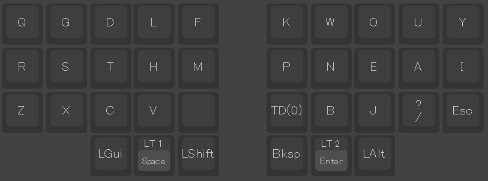
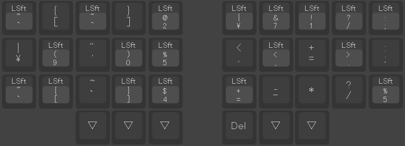
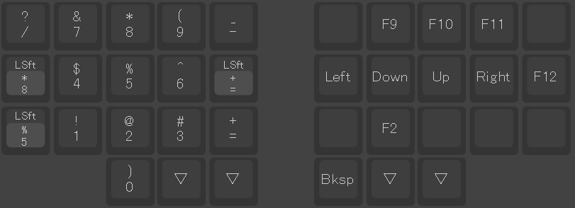

<detail>

## X7s

### タップダンス

| -   | タップ | ホールド |
| --- | ------ | -------- |
| TD0 | .      | ,        |

### コンボ

| キー1 | キー2 | 入力                  |
| :---: | :---: | :-------------------- |
|   Q   |   G   | Esc                   |
|   G   |   D   | Tab                   |
|   R   |   S   | Ctrl                  |
|   Z   |   X   | PrtScrn(Gyazo起動)    |
|   D   |   H   | F24(IME無効化/有効化) |

### レイヤー

|                                     |
| ----------------------------------- |
|  |
|  |
|  |

