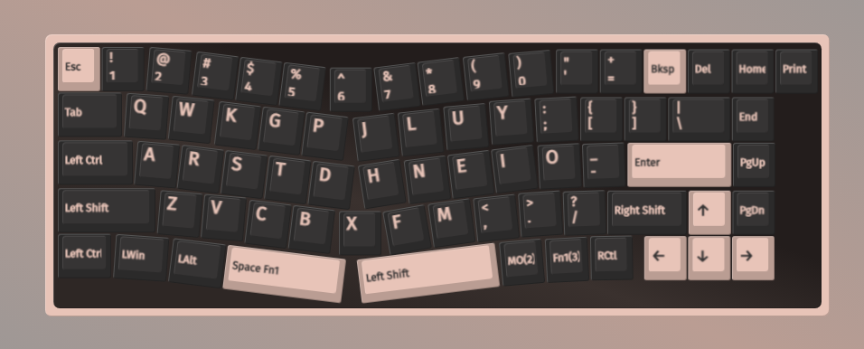
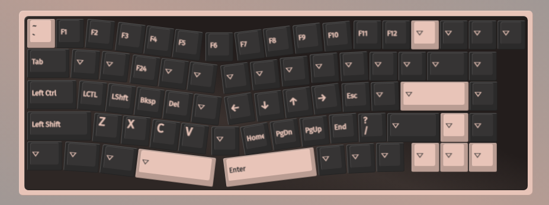

##### こる幕 (Colemakベース)

- レイヤー1


- レイヤー2


- 右側のBS, Enterは基本的には押さずにレイヤー切り替えで対応
- 分割スペース前提

---
```
---------------------------------------------
  ~  !  @  #  $  %  ^  &  *  (  )  ?  +  ____
  `  1  2  3  4  5  6  7  8  9  0  /  =   BS
 ___                             :  {  }  |  
 Tab  q  w  k  p  g  j  l  u  y  ;  [  ]  \  
 ____                             :  "  _____
 Caps  a  s  d  f  g  h  j  k  l  ;  '  Enter
 _____                       <  >  _  _______
 Shift  z  v  b  c  x  f  m  ,  .  -   Shift
---------------------------------------------
```
