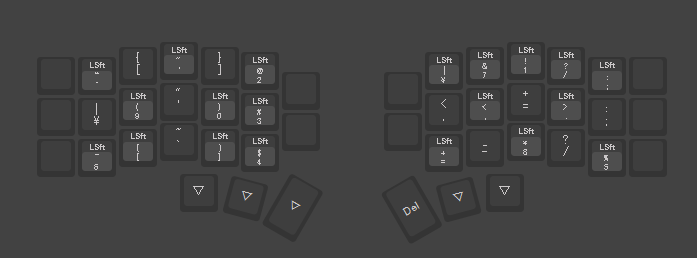
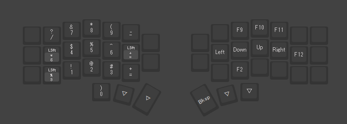

<detail>

## Corne V4 Cherry

### タップダンス

| -   | タップ | ホールド              |
| --- | ------ | --------------------- |
| TD0 | t      | -                     |
| TD1 | e      | ,                     |
| TD2 | h      | F24(IME有効化/無効化) |
| TD3 | a      | .                     |

### コンボ

| キー1 | キー2 | 入力               |
| ----- | ----- | ------------------ |
| Q     | G     | Esc                |
| G     | D     | Tab                |
| R     | S     | Ctrl               |
| Z     | X     | PrtScrn(Gyazo起動) |

### レイヤー

| -   | -                                               |
| --- | ----------------------------------------------- |
| 0   |  |
| 1   |  |
| 2   |  |